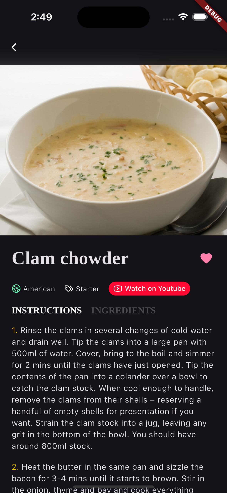
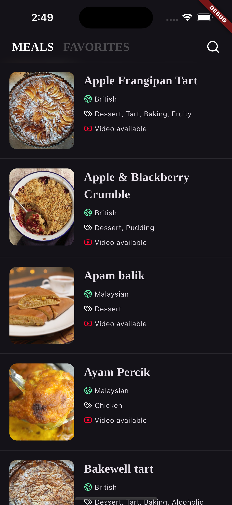

# Cookbook

## Getting Started

The project was created with Flutter 3.29.0 using [fvm](https://fvm.app/)
but it should work with any valid installation of such version.

### Steps to run

Open a a terminal at the root of the project and run

```bash
flutter pub get
```

After that we can simply run the app

```bash
flutter run
```

or run the tests

```bash
flutter test
```

## Architecture

The app follows a feature-folder strcuture where a folder contains all the code related to a single feature (models, services, BLoCs, views) and follows clean architecture principles where we have three layers of concerns data -> BLoC -> view.

The data layer is composed by

- objects: simple data classes
- services: like apis, key-value stores or any other data source
- repositories: the glue between objects and services, these often combine multiples services and offer a simpler API for external callers

The BLoC layer is the state managament solution, here we transform any user events into app or local state that the view can render.

The view layer is any UI the user can interect with, the UI's only concern is to handle their own ephemeral state, render the BLoC state and feed events to it.

You can find more information about the inner working of some the components in the code comments of some file (like BLoCs or Repositories).


## Features

- Minimalist UI & UX
- Custom fonts
- Search
- Pagination
- Favorites
- Empty & retry states
- Implicit and scroll driven animations

## Screenshots

| Detail                             | Favorites                               | Ingredients                                 | Meals                           | Search Empty                                  | Search Results                            |
| ---------------------------------- | --------------------------------------- | ------------------------------------------- | ------------------------------- | --------------------------------------------- | ----------------------------------------- |
|  |  |  |  |  |  |
